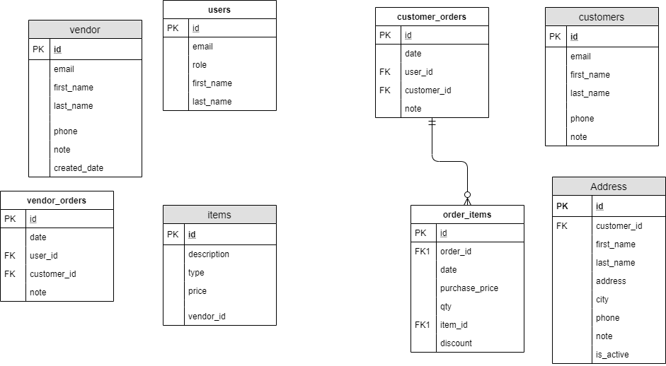

git 

## items

- get 
  - items
  - items/:id
- post
  - items
  - items/:id
  - items/:id/delete

## users

- get 
  - users
  - users/:id
- post
  - users
  - users/:id
  - users/:id/delete

## customers

- get 
  - customers
  - customers/:id
  - customers/:id/addresses
  - customers/:id/addresses/:id
- post
  - customers
  - customers/:id
  - customers/:id/delete
  - customers/:id/addresses/:id
  - customers/:id/addresses/:id/delete

## vendors

- get 
  - vendors
  - vendors/:id
  - vendors/:id/addresses
  - vendors/:id/addresses/:id
- post
  - vendors
  - vendors/:id
  - vendors/:id/delete
  - vendors/:id/addresses/:id
  - vendors/:id/addresses/:id/delete
  
## customer-orders

- get 
  - customer-orders
  - customer-orders/:id
- post
  - customer-orders
  - customer-orders/:id
  - customer-orders/:id/delete

## vendor-orders

- get 
  - vendor-orders
  - vendor-orders/:id
- post
  - vendor-orders
  - vendor-orders/:id
  - vendor-orders/:id/delete

